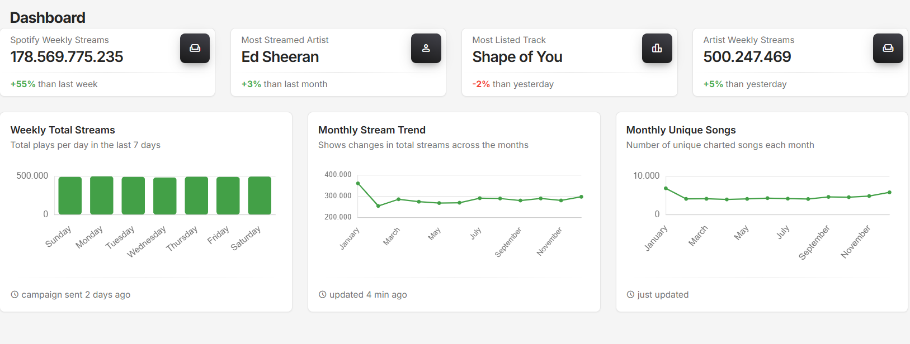
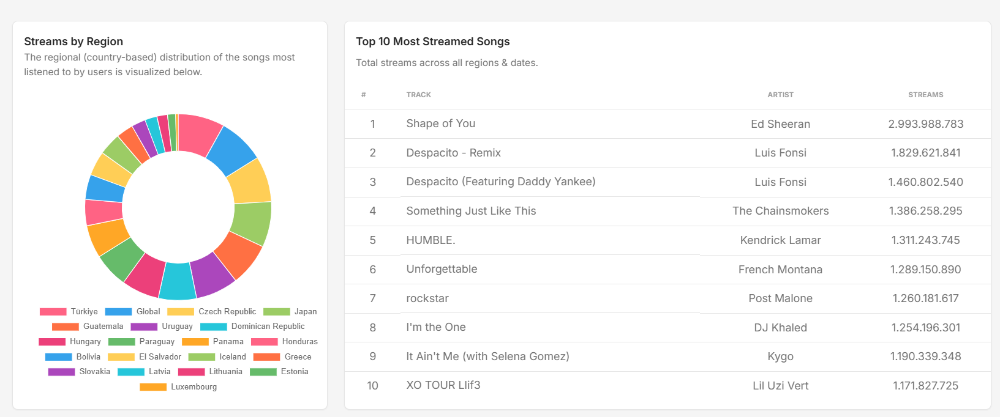
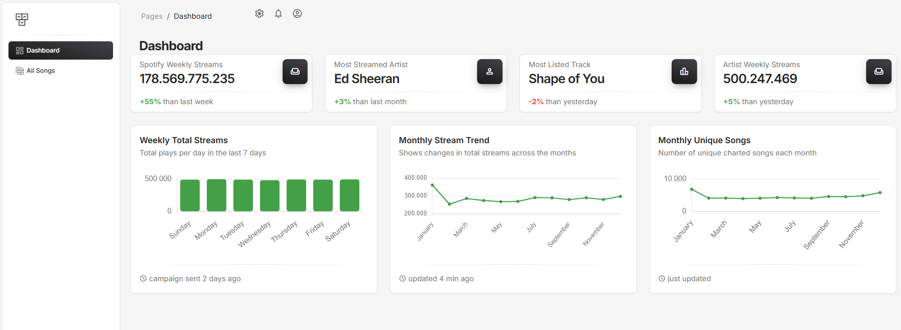
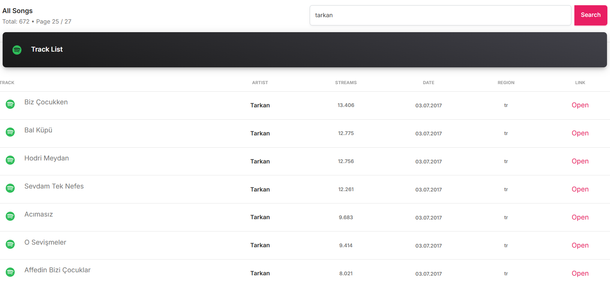
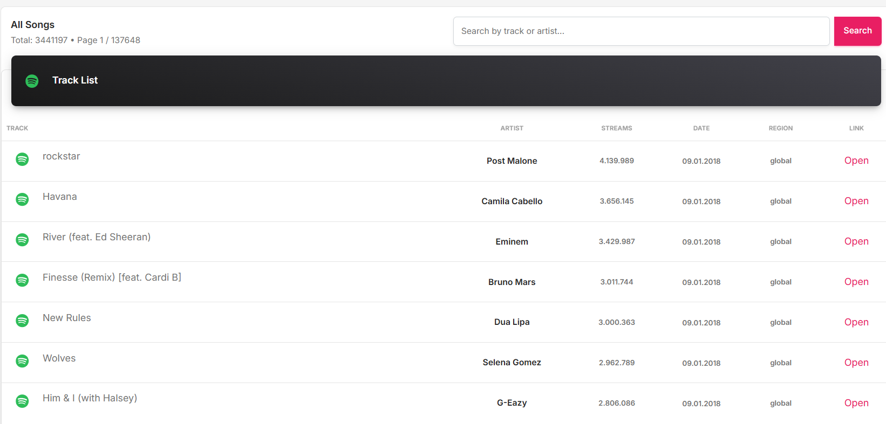
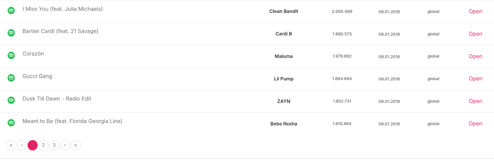

# 🎵 DapperSpotifyProject

Bu proje, **ASP.NET Core MVC** ve **Dapper ORM** kullanılarak geliştirilmiş, **Spotify Global Daily Song Ranking** verisetini analiz eden yüksek performanslı bir müzik analiz dashboardudur.  

## 📌 Proje Amacı
Spotify’da en çok dinlenen şarkı ve sanatçıların günlük, haftalık ve ülke bazlı analizlerini yaparak görselleştirmek ve kullanıcıya hızlı veri erişimi sağlamaktır.

## 🛠️ Kullanılan Teknolojiler
- **ASP.NET Core MVC**
- **Dapper ORM** – Yüksek performanslı veri erişimi
- **MSSQL (LocalDB)**
- **Chart.js** – Dinamik ve interaktif grafikler
- **Bootstrap 5** – Responsive arayüz
- **DTO yapısı & optimize SQL sorguları**

## 📊 Dashboard Özellikleri
- 📅 **Günlük Toplam Dinlenme Sayıları**
- 🎤 **En Çok Dinlenen Sanatçılar**
- 🎶 **En Çok Listelere Giren Şarkılar**
- 🌍 **Ülkelere Göre Şarkı Sayısı** *(Bar Chart)*
- 📈 **Haftalık Toplam Dinlenme Trendi** *(Line Chart)*

## 🎵 All Songs Sayfası
- Tüm şarkıları listeleme
- Sayfa bazlı arama ve filtreleme
- Şarkı adına veya sanatçıya göre hızlı arama
- Dinlenme sayısına göre sıralama

## 📂 Dataset
Proje, **Kaggle - Spotify Worldwide Daily Song Ranking** veriseti kullanılarak geliştirilmiştir.  
🔗 [Veriseti Linki](https://www.kaggle.com/datasets/edumucelli/spotify-daily-chart)

## 📸 Ekran Görüntüleri

### Dashboard

### Search

### Songs

